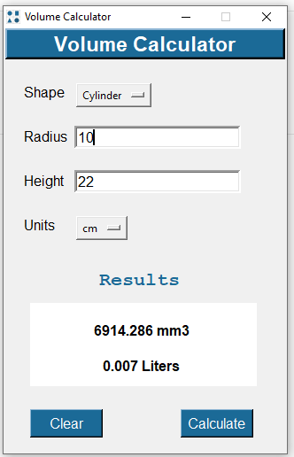

# Volume Calculator

 This calculator is to easily calculate the volume of geometric solids including a **Cylinder, Cone, Cuboid, Sphere**. The input values can be given multiple metric/unit:  mm, cm, in. The volume of every shape is calculated differently using different formulas. 
User can select the desired shape from the Shape drop-down list and the entry fields are automatically configures as per input requirements for each mentioned shape.
# Features
* Standard Calculator functionality which offers basic operations and evaluates commands immediately as they are entered.
* Multiple shapes and Metric/Unit operations.
* Auto Liters conversion as per selected unit

# Getting started
<b>Prerequisites :</b>

* Your computer must be running Windows 10 or newer.
* Install the latest version of Application. [Download v1.1](https://github.com/4BH1J337/Volume-Calculator/releases/download/Version1.1/Volume.calculator.setup.exe)
* Application Size : 12 MB 

## Start with [Python](PYTHON.md) Programme

### Program Execution

#
### Input & Output Function
 
#
* The units are shown for convenience but do not affect the calculations. The units  are in place to give an indication
  of the order of the result such as mm3,cm3 or Litres.

* Calculate the volume of a right circular cylinder given 2 known values.
  Enter height and radius and select the right shape, it will give you the volume.

#
# License

Copyright © Abhijeet kumar. All rights reserved.

Licensed under the [MIT License.](https://github.com/4BH1J337/Volume-Calculator/blob/main/LICENSE)
